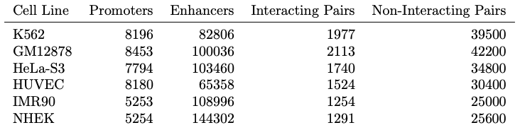

# gcn4epi
Graph Convolutional Networks for Prediction of Enhancer-Promoter Interactions

## Environment Setup

1. Create and activate a fresh virtual environment:

```bash
python -m venv ~/env/gcn_env
source ~/env/gcn_env/bin/activate
pip install --upgrade pip
```

2. Install [pcdhit](https://github.com/simomarsili/pcdhit) and [cd-hit](https://github.com/weizhongli/cdhit) packages.

```bash
git clone https://github.com/simomarsili/pcdhit.git
python pcdhit/setup.py install
git clone https://github.com/weizhongli/cdhit.git
cd cdhit
make openmp=no
realpath cd-hit /usr/local/bin | xargs sudo ln -s
cd ..
```

3. Install all required packages:
```bash
pip install -r requirements.txt
```

## Running Instructions

Run `prepare_gcn_data.py` and `train.py` modules, respectively.

**Example:**
```bash
cd gcn
python prepare_gcn_data.py --cell_line='GM12878' --k_mer=5 --seed=42 --label_rate=0.2 --frag_len=200 --balanced
python train.py --cell_line='GM12878' --k_mer=5 --seed=42 --label_rate=0.2 --frag_len=200
```

## Data Requirements

1. Download Human Genome **GRCh37** from [Human Genome Resources at NCBI](https://www.ncbi.nlm.nih.gov/projects/genome/guide/human/index.shtml) and place it under `gcn/data/` directory. **Example:** `gcn/data/GRCh37_latest_genomic.fna`

2. Run `prepare_gcn_data.py` module to prepare data files required by `train.py` module.



| **File Name** | **Description** |
| :--           | :--             |
| x_20.index   | the indices (IDs) of labeled train instances as list object (for label_rate = 20%) |
| ux_20.index  | the indices (IDs) of unlabeled train instances as list object (for label_rate = 20%) |
| vx_20.index  | the indices (IDs) of validation instances as list object (for label_rate = 20%) |
| tx_20.index  | the indices (IDs) of test instances as list object (for label_rate = 20%) |
| features_5mer | the feature vectors of **all** instances as scipy.sparse.csr.csr_matrix object (for k_mer = 5) |
| nodes         | a dict in the format **{chromosome_name: ID}** as collections.defaultdict object |
| labels        | the one-hot labels of **all** instances as numpy.ndarray object |
| graph         | a dict in the format **{ID: [IDs_of_neighbor_nodes]}** as collections.defaultdict object |


## References

**TargetFinder:** https://github.com/shwhalen/targetfinder

**Planetoid:** https://github.com/kimiyoung/planetoid

**GCN:** https://github.com/tkipf/gcn

**bert-enhancer:** https://github.com/khanhlee/bert-enhancer
