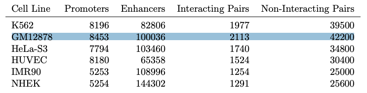

# gcn4epi
Graph Convolutional Networks for Prediction of Enhancer-Promoter Interactions

## Running Instructions

1. Create virtual environment with required packages.

```bash
python -m venv ~/env/gcn_env
source ~/env/gcn_env/bin/activate
pip install --upgrade pip
pip install -r requirements.txt
python setup.py install
```

2. Run `gcn/fetch_and_parse.py`, `gcn/prepare_gcn_data.py`, and `gcn/train.py`, respectively.

**Example:**
```bash
cd gcn
python fetch_and_parse.py --cell_line='GM12878' --k_mer=5
python prepare_gcn_data.py --cell_line='GM12878' --k_mer=5 --seed=42 --label_rate=0.2
python train.py --cell_line='GM12878' --seed=42
```

## Data Requirements

1. Download Human Genome **GRCh37** from [Human Genome Resources at NCBI](https://www.ncbi.nlm.nih.gov/projects/genome/guide/human/index.shtml) and place it under `gcn/data/` directory. **Example:** `gcn/data/GRCh37_latest_genomic.fna`

2. Run `gcn/fetch_and_parse.py` and `gcn/prepare_gcn_data.py` modules respectively to prepare data files required by `gcn/train.py` module.



| **File Name** | **Description** |
| :-- | :-- |
| x.index  | the indices of labeled train instances as list object |
| ux.index | the indices of unlabeled train instances as list object |
| vx.index | the indices of validation instances as list object |
| tx.index | the indices of test instances as list object |
| labels   | the one-hot labels of **all** instances as numpy.ndarray object |
| features | the feature vectors of **all** instances as scipy.sparse.csr.csr_matrix object |
| nodes    | a dict in the format **{id: chromosome_name}** as collections.defaultdict object |
| graph | a dict in the format **{id: [id_of_neighbor_nodes]}** as collections.defaultdict object |

## References

**TargetFinder:** https://github.com/shwhalen/targetfinder

**Planetoid:** https://github.com/kimiyoung/planetoid

**GCN:** https://github.com/tkipf/gcn